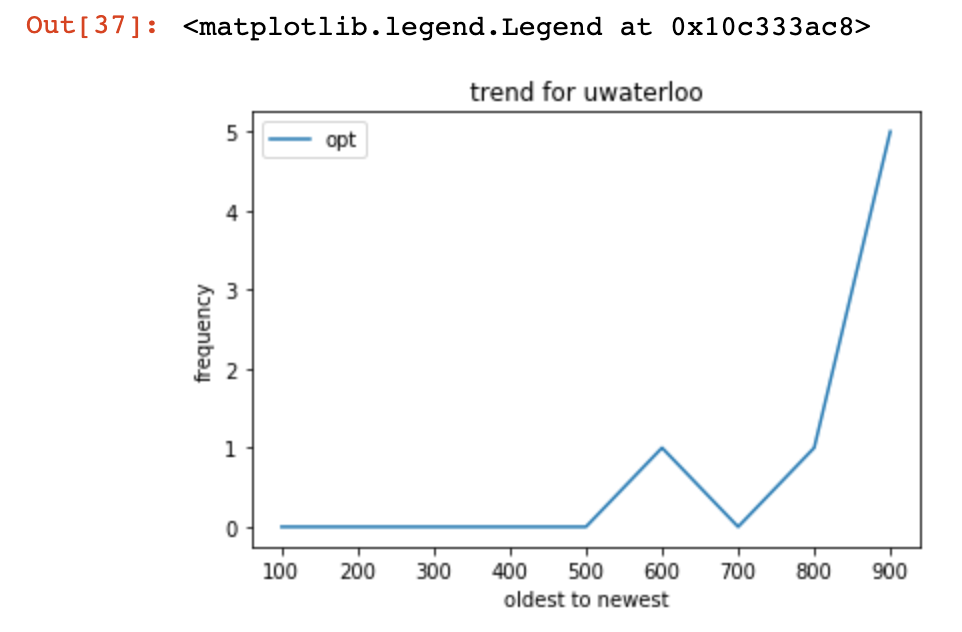
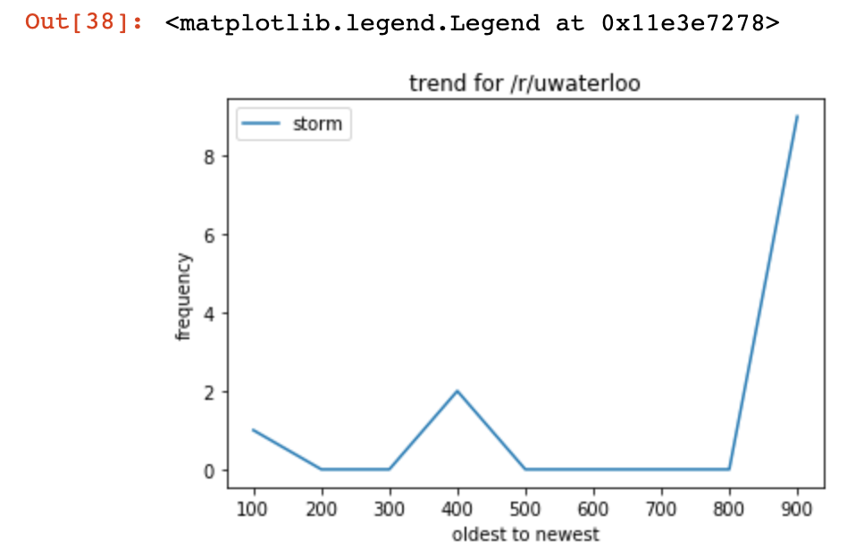

# Data Analytics for Reddit
Data Anaytics for Reddit tool scrapes posts from Reddit using the Python Reddit API Wrapper (PRAW) and visualizes the data of keywords using matplotlib. 

I am currently working on hosting this [online](http://tttzach.pythonanywhere.com/analytics) so that users can try it on their own. Do note that it is work in progress.

Here are some examples of visualizations from the /r/uwaterloo subreddit.

Possible improvements:
Use dates instead of posts for x-axis.
